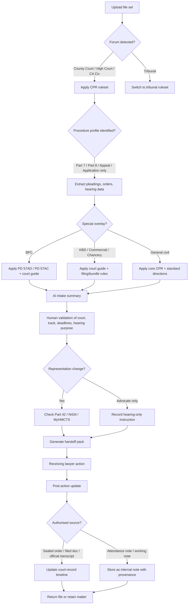
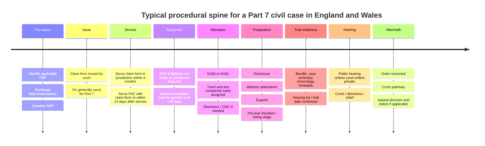

# CasePass Procedural Grounding for Civil Hearings in England and Wales

## Executive summary

For England and Wales, CasePass should treat civil procedure as a layered system rather than a single generic workflow. The foundation is statutory and rule-based: the Civil Procedure Act 1997 frames the civil justice system around accessibility, fairness and efficiency; the CPR apply across the County Court, High Court and the Civil Division of the Court of Appeal; and the overriding objective requires proportionality, effective participation, and the efficient conduct of litigation. That core must then be overlaid by track-specific rules, specialist court guides, digital filing rules, sector-specific pre-action protocols, tribunal procedure where applicable, and court-specific listing/bundle requirements. citeturn23search6turn4search14turn18view0turn20view0

The most reliable baseline for CasePass is therefore a rules hierarchy. At the highest level, the agent should prioritise: statutes and legislation; the CPR; the relevant Practice Direction; the operative pre-action protocol; the latest sealed order in the case; the applicable court guide or tribunal guidance; and only then official explanatory guidance, forms guidance, and operational publications. The rules that matter most for a case-transfer tool are not only “hearing rules” in the narrow sense, but also commencement, service, response, applications, allocation, disclosure, evidence, listing, sanctions, costs, representation changes and appeals. citeturn34view4turn34view5turn34view6turn18view2turn18view3turn18view4turn18view5turn18view6turn18view7turn18view10turn18view11turn18view13

Three procedural fault-lines are especially important. First, disclosure is not uniform: ordinary civil cases use Part 31, small claims are excluded from Part 31, and the Business and Property Courts use PD 57AD instead of the old general disclosure pilot, with a different structure and different expectations. Second, evidence is not uniform: ordinary witness evidence flows through Part 32 and PD 32, but Business and Property Courts trial witness statements are constrained by PD 57AC. Third, forum matters: if the matter is actually in a tribunal, the CPR may not govern it at all, and the tool must switch rule sets instead of “mapping” tribunal practice onto county-court assumptions. citeturn18view6turn37view0turn19view18turn18view7turn19view5turn19view19turn21view3turn22view0turn8search1

For the user workflow described for CasePass, the main adaptation to English civil practice is conceptual as much as linguistic. A transfer between lawyers is not automatically a “change of attorney on the record.” In England and Wales, the critical procedural question is whether there is a change of solicitor or legal representative requiring notice under Part 42 and PD 42, or whether the receiving lawyer is only instructed as advocate/counsel for a hearing. The product should therefore ask about the solicitor on the record, the advocate instructed for the hearing, and whether a notice of change has been or must be filed. It should also avoid any feature that implies recording a hearing without authorisation: if the lawyer wants a post-hearing update, the safe options are a dictated attendance note after the hearing or an official transcript workflow using EX107, not ambient recording of the proceedings. citeturn34view9turn34view10turn34view11turn30search19turn30search0turn19view15

The safest implementation pattern is a **human-in-the-loop procedural assistant** with a source hierarchy, ruleset selector, provenance tracking, uncertainty labels, and express non-advisory language. It should summarize procedure, deadlines, filings, orders, bundles and next steps from the record; it should not determine merits, limitation, settlement value, or strategic legality without lawyer confirmation. That architecture is scalable to other common-law jurisdictions because it separates the stable civil-litigation spine from local overlays and specialist forums. citeturn18view0turn18view1turn18view10turn20view5turn20view6turn35view0

## Primary procedural architecture for hearings and case transfer

The statutory and rule architecture that should anchor CasePass is relatively clear. The Civil Procedure Act 1997 provides the policy basis for accessible, fair and efficient civil justice. The CPR then operate as the procedural code for the County Court, High Court and Civil Division of the Court of Appeal. Evidence is also partly underpinned by statute, especially the Civil Evidence Act 1995 on hearsay and documentary proof. Remote observation and remote-recording rules now sit in the statutory framework created by the Courts Act 2003 and the Police, Crime, Sentencing and Courts Act 2022, which added sections 85A and 85B to regulate remote observation and make unauthorised recording or transmission an offence. CPR Part 25 also cross-refers to pre-action disclosure and inspection powers under section 33 of the Senior Courts Act 1981 and section 52 of the County Courts Act 1984. citeturn23search6turn4search14turn23search1turn23search5turn30search0turn34view3

| Procedural zone | Core rules and documents | Why CasePass should extract and reason over them |
|---|---|---|
| Foundational scope, overriding objective and participation | Civil Procedure Act 1997; CPR Parts 1–2; PD 1A citeturn23search6turn18view0turn4search14turn20view0 | These sources determine the procedural scope of the CPR, the proportionality/equality framework, and the need to identify vulnerability, participation barriers and adjustments early. |
| Issue, service and response | CPR Parts 6, 7, 10, 15, 16; PD 6A; PD 7A citeturn34view4turn34view5turn34view6turn19view1turn19view2turn34view8 | CasePass should extract when proceedings were issued, how and when service occurred, whether an acknowledgment of service was required, whether the defence window was extended by agreement, and whether the claim form/particulars state the right remedy and value. |
| Clarification, applications and urgent relief | CPR Parts 18, 23, 24, 25; PD 18; PD 23A citeturn34view1turn34view2turn18view2turn34view0turn34view3turn19view0 | Handoffs often concern interim or contested procedural steps. The agent should recognise Part 18 requests, N244 applications, summary-judgment applications and interim remedies, including without-notice applications and urgent pre-issue relief. |
| Allocation, tracks and case management | CPR Parts 26–30; PD 26; PD 28; PD 29; PD 30; standard directions/model orders citeturn18view3turn18view4turn18view5turn20view10turn19view6turn19view7turn32search3turn32search7turn20view1turn20view2 | Track, complexity band and directions drive nearly every hearing-related deadline. CasePass should treat track/list allocation as a first-order metadata field, not as a cosmetic label. |
| Disclosure | CPR Part 31; PD 31B; Form N265; PD 57AD for BPC cases citeturn18view6turn37view0turn19view4turn19view14turn19view18 | The tool must detect whether the case uses ordinary standard disclosure, electronic-disclosure management, or the BPC disclosure regime. This is a major source of AI error if misclassified. |
| Evidence, witness material and bundles | CPR Part 32; PD 32; CPR Part 35; PD 35; PD 57AC for BPC trial witness statements; e-bundle guidance citeturn18view7turn37view1turn19view5turn18view8turn37view2turn19view9turn19view19turn18view19 | CasePass should identify whether evidence is written or oral, whether witness statements have been served, whether expert evidence is permitted and limited, and what bundle obligations apply. |
| Hearings, publicity, listing and orders | CPR Part 39; standard trial arrangements; HMCTS hearing lists; remote-observation guidance; Part 40 for orders citeturn18view10turn20view3turn35view2turn18view18turn24search13 | Public/private status, hearing mode, list information, bundle timing and order extraction are central to a hearing handoff. |
| Representation changes | CPR Part 42; PD 42; Form N434 citeturn34view9turn34view10turn34view11 | The handoff engine must distinguish a true change of legal representative from a one-off advocacy instruction. |
| Costs, sanctions and settlement | CPR Part 3; PD 3D; CPR Part 36; CPR Parts 44–45 and PD 44; Part 47; pilots PD 51ZG1–3 citeturn26view0turn26view3turn18view12turn18view9turn18view11turn26view5turn26view6turn28search1turn14search0turn14search6turn20view11turn20view12turn20view13 | Costs exposure, budget status, FRC regimes, QOCS, sanctions and Part 36 consequences materially affect hearing preparation and post-hearing updates. |
| Appeals | CPR Part 52 and PD 52B; EX340; N161/N164 citeturn18view13turn19view16turn19view17turn16search2 | If the receiving lawyer is instructed after an order or judgment, the tool must detect whether the next valid action is appeal-related, including whether the correct notice form is N161 or N164 and whether a late appeal needs an extension application inside the notice. |

A few timing rules are especially valuable for AI extraction because they recur. Part 7 states that proceedings start when the court issues the claim form; particulars of claim must usually be served with the claim form or within 14 days after service, and service within the jurisdiction must generally be completed within four months of issue. Part 15 allows claimant and defendant to agree up to 28 days’ extra time for the defence. In multi-track cases, the court may send a pre-trial checklist unless the claim can proceed without one; in the multi-track PD the filing date should be no later than eight weeks before trial and the court serves the checklist at least 14 days before that date. In fast/intermediate cases, failure to file a pre-trial checklist can trigger unless orders and strike-out consequences. citeturn34view4turn19view1turn37view6turn37view8turn37view7

One point that matters for product design is that there is **no current standalone general civil Practice Direction supplementing Part 39 listed in the CPR rules menu**. In practice, hearing operations are therefore spread across Part 39 itself, PD 32 bundle provisions, judiciary e-bundle guidance, standard directions, and court-specific guides such as the King’s Bench Guide, Commercial Court Guide and Chancery Guide. Any AI agent that searches only for a single “hearing PD” will miss important operational rules. citeturn13search2turn18view10turn19view5turn18view19turn20view4turn20view5turn20view6

## Official practice directions, forms and court-specific overlays

The pre-action layer is essential because CasePass will often receive a file before a hearing but after pre-action exchanges have already shaped the case. The Practice Direction on Pre-Action Conduct and Protocols says the court expects parties, before proceedings, to exchange enough information to understand positions, make decisions, try to settle, consider ADR, support efficient management and reduce costs. The current official protocol index shows how fragmented the pre-action landscape is, with separate protocols for construction and engineering disputes, professional negligence, clinical disputes, personal injury, debt claims, housing conditions in England, housing disrepair in Wales, mortgage possession and social landlord possession, among others. Protocol-specific timing can be materially different: for example, the Clinical Disputes Protocol gives the defendant four months to investigate and respond to the Letter of Claim. citeturn18view15turn18view16turn7search9

The official secondary sources that deserve priority are the documents that formalise or explain how the CPR are to be applied in practice by specific courts: standard directions and model orders; the General Guidance on Electronic Court Bundles; the King’s Bench Guide; the Commercial Court Guide; the Chancery Guide; and official guidance on experts, appeals, fees and transcripts. These are far more dependable grounding material than blogs because they are either issued by the judiciary, HMCTS, or published on the official CPR/Judiciary/GOV.UK platforms. citeturn20view1turn20view2turn18view19turn20view4turn20view5turn20view6turn36search1turn19view16turn35view1

| Operational document | What it covers for CasePass | Official source |
|---|---|---|
| PD – Pre-Action Conduct and Protocols, plus protocol index | Determines whether the matter is still pre-issue, which protocol applies, whether a Letter of Claim/Response exists, and whether ADR/settlement steps were required before issue. | citeturn18view15turn18view16 |
| Standard directions and model orders | Provide practical templates for directions and are useful for AI extraction of standard multi-track/track management patterns. | citeturn20view1turn20view2 |
| Trial arrangements standard direction | Sets a common baseline for what the claimant usually files before trial: indexed/paginated bundle, case summary, chronology and trial timetable, usually 7 to 3 clear days before trial. | citeturn20view3 |
| Form N244 | Core application notice for many interim and procedural applications. | citeturn19view11 |
| Forms N180 and N181 | Directions questionnaires for small claims and for fast/intermediate/multi-track matters. | citeturn19view13turn19view12 |
| Form N170 and related allocation/listing forms | Listing questionnaire (pre-trial checklist), allocation/listing notices, trial-date notices, unless orders and related case-management forms. | citeturn35view3 |
| Form N265 | Standard disclosure list; useful for disclosure-status extraction. | citeturn19view14 |
| Form N260 model and PD 44 summary-assessment rules | Summary-assessment costs statements and timing/compliance expectations. | citeturn19view10turn26view6 |
| Form N434 and digital notice of change route | Formal change-of-representative process, including MyHMCTS route where applicable. | citeturn34view10turn34view11turn29search6 |
| Form EX107 | Official transcript request process for court or tribunal proceedings. | citeturn19view15turn30search8 |
| EX340, N161 and N164 | Official civil-appeal guidance and appeal notices. | citeturn19view16turn19view17turn16search2 |
| HMCTS hearing lists | Official listing information and the hearings service for civil county courts, RCJ/Rolls Building, and many tribunals. | citeturn35view2 |
| General guidance on electronic court bundles | Normal baseline for e-bundles in court hearings; expressly not tribunal hearings. | citeturn18view19 |
| Experts guidance and PD 35 | Best practice for instruction of experts under Part 35. | citeturn19view9turn36search1 |
| Fee guides EX50 and EX50A | Current court-fee lookups and the official full-list fee page for validation of filing/handover assumptions. | citeturn35view1turn20view7turn20view8 |

Court-specific overlays matter because many “civil hearing” tasks are actually list-specific. The King’s Bench Guide 2026 is an updated practical guide to the working practices of the King’s Bench Division and expressly notes the incorporation of the new PD 5C CE-File regime. The Commercial Court Guide calls itself the key practical point of reference for litigants in that court. The Chancery Guide states that it supplements the CPR for Chancery lists across the Business and Property Courts and covers commencement and transfer, case and costs management, trial, applications, orders and appeals. A CasePass agent that does not detect these overlays will produce summaries that look procedurally plausible but operationally wrong. citeturn20view4turn20view5turn20view6

Tribunal matters are the clearest switch point. Employment Tribunal cases are governed by their own procedure rules and England-and-Wales practice directions/guidance, not by the CPR hearing architecture. Property Chamber disputes likewise operate under the Tribunal Procedure (First-tier Tribunal) (Property Chamber) Rules, which cover how hearings are conducted and how the tribunal reaches decisions. The Tax Chamber is another example of a chamber operating under its own Tribunal Procedure Rules. For CasePass, the correct design is therefore not “CPR with tribunal exceptions,” but a **ruleset selector** that moves the matter onto a tribunal pathway as soon as the forum is identified. citeturn22view0turn8search0turn21view3turn8search1

## Workflow adaptation for CasePass

The user concept behind CasePass fits England and Wales well if it is translated into the language and logic of English civil procedure. The key user roles should be expressed as **solicitor on the record**, **instructing solicitor**, **receiving solicitor**, **instructed counsel/barrister**, **advocate for hearing**, or **litigation friend** where relevant, rather than generic “attorney” labels. The first procedural question in a transfer is whether representation on the court record is changing under Part 42, because a one-off hearing instruction is treated differently from a full change of solicitor. Part 42 expressly carves out the case where a solicitor is appointed only to act as an advocate for a hearing, and PD 42 directs that N434 is used for notice of change unless the digital MyHMCTS route applies. citeturn34view9turn34view10turn34view11

A second translation issue concerns the user’s idea of voice-based updating. In England and Wales, that feature must be framed as a **post-hearing attendance note workflow** or an **official transcript import workflow**, not as a hearing-recording workflow. Judiciary guidance on remote observation says remote observers must not record or transmit what they see or hear, and section 85B of the Courts Act 2003 criminalises unauthorised remote recording or transmission. HMCTS provides EX107 precisely because the authorised route to a verbatim hearing record is transcript request, not informal recording. citeturn30search19turn30search0turn19view15

A third translation issue is evidential. At hearings other than trial, evidence is generally by witness statement; a party may sometimes rely on verified statements of case or verified application notices; and any false statement in a document verified by a statement of truth carries potential contempt consequences. CasePass should therefore separate: **court-record facts** extracted from filed/served documents and sealed orders; **working assumptions** inferred from gaps; and **lawyer notes** that are expressly internal and non-evidential. That separation is important both for procedural accuracy and for privilege/confidentiality governance. citeturn37view1turn31search0turn31search2



This workflow reflects the distinction between core CPR procedure, specialist overlays, representation-change rules, and tribunal divergence. It is grounded in CPR Parts 23, 26, 28, 29, 32, 39 and 42, together with the BPC disclosure/witness-statement directions, standard directions, and official transcript guidance. citeturn18view2turn18view3turn18view4turn18view5turn37view1turn18view10turn34view9turn19view18turn19view19turn20view1turn19view15

| Workflow stage | Minimum AI outputs | Questions the AI agent should ask in English civil-procedure terminology | Why these questions matter |
|---|---|---|---|
| Upload | Forum, court, list, case number, parties, document inventory, likely stage | “Which court or tribunal is this in?” “Is this County Court, High Court, Civil Division appeal, or a tribunal?” “What is the claim number and full title of proceedings?” “Which documents are sealed orders, which are filed pleadings, and which are internal notes?” | The first error to avoid is using the wrong procedural code or confusing internal notes with court documents. citeturn4search14turn22view0turn21view3turn31search2 |
| AI intake | Procedural map, deadlines map, hearing map, missing-documents list | “Was the claim issued under Part 7 or Part 8?” “Has service been effected, and by what method?” “Is an acknowledgment of service or defence outstanding?” “Has there been a Part 18 request, N244 application, summary-judgment application, or interim-relief application?” | These are the documents that determine live procedural posture and the next valid step. citeturn34view4turn34view5turn34view6turn34view1turn18view2turn34view0turn34view3 |
| Human review | Confirmed forum, track, next event, risk flags | “Please confirm the track and any complexity band.” “Is this small claims, fast track, intermediate track or multi-track?” “Is the matter in the Business and Property Courts, and if so which list?” “Does any sealed order vary the default CPR timetable?” | Track and list selection drive disclosure, witness, costs and listing obligations, and sealed orders may displace default rule assumptions. citeturn18view3turn18view4turn18view5turn19view18turn19view19 |
| Handoff | Solicitor/counsel handoff pack, action memo, deadline dashboard | “Who is the solicitor on record?” “Is the receiving lawyer taking over conduct of the claim, or acting only as advocate/counsel for the hearing?” “Has a notice of change been filed, or must one be filed?” “What is the purpose of the upcoming hearing: CMC, interim application, PTR, trial, costs hearing, or appeal?” | This converts the user concept of “passing a file” into the correct English-law procedural act. citeturn34view9turn34view10turn34view11turn18view2turn18view10 |
| Receiving action | Hearing-prep checklist and filing checklist | “Are there live bundle obligations?” “Has the listing questionnaire / pre-trial checklist been filed?” “Are witness statements, experts’ reports, or disclosure steps outstanding?” “Is a statement of costs required for summary assessment?” “Is a draft order or skeleton argument expected by this court guide?” | Hearing-readiness depends on bundle, evidence, costs and court-guide compliance, not just hearing date. citeturn19view5turn37view6turn37view7turn19view9turn19view10turn20view3turn20view5turn20view6 |
| Post-action update | Attendance note, order digest, next-step map, provenance labels | “Was an order made, and is there a sealed or approved version?” “Were costs reserved, awarded, summarily assessed, or subjected to detailed assessment?” “Was permission to appeal sought or granted?” “Do you want to upload a dictated attendance note after the hearing, or import an official transcript later?” | Post-hearing accuracy depends on distinguishing orders, notes and transcript status, and on correctly recording appeal/costs consequences. citeturn18view11turn26view5turn18view13turn19view15 |



This timeline reflects the standard CPR route for a typical Part 7 civil matter, while leaving space for court-ordered variation, specialist lists and pilots. citeturn34view4turn34view6turn19view1turn18view3turn37view6turn20view3turn18view10turn18view13

## Error points, ambiguities and guardrails

The largest operational risk is **misclassification**. If the tool mistakes a tribunal matter for an ordinary CPR claim, mistakes a BPC matter for a generic county-court claim, or assumes a small claim uses the same disclosure structure as a multi-track case, it will produce incorrect next-step advice even if its document summarisation is excellent. Ordinary standard disclosure under Part 31 requires disclosure of documents relied on and documents that adversely affect one’s own case, adversely affect another party’s case, or support another party’s case, together with a reasonable search. But Part 31 does not apply to small claims, while PD 57AD applies across BPC proceedings and expressly does not apply in the County Court. That procedural divergence is too significant to smooth over with generalisation. citeturn37view0turn18view6turn19view18

A second risk is **assuming the “hearing” is the only event that matters**. In civil practice, many handoffs turn on case-management directions, PTRs, disclosure conferences, costs budgeting, listing questionnaires, or the need to prepare an application bundle, draft order or costs statement. PD 29 expressly builds the multi-track route around the pre-trial checklist and post-checklist listing/trial management, and PD 28 imposes sanctions for failure to file pre-trial checklists. Likewise, Part 44 and PD 44 mean hearing preparation may require costs material suitable for summary assessment. The AI should therefore identify the hearing purpose, not only the hearing date. citeturn37view6turn37view8turn37view7turn26view5turn26view6

A third risk is **improper handling of proof and provenance**. At hearings other than trial, evidence is usually written; some interim applications may rely on verified pleadings or verified application notices; and documents using statements of truth carry contempt risk if false. The product should never silently merge internal case notes, AI summaries, and court-filed materials into a single undifferentiated “case record.” It should require provenance labels such as: sealed order, filed pleading, served witness statement, expert report, attendance note, internal strategy note, draft order, transcript requested, transcript received. citeturn37view1turn31search0turn31search2

| Risk area | Why the AI may err | Guardrail |
|---|---|---|
| Court/tribunal confusion | Tribunal matters follow separate procedural rules and guidance. | Require a mandatory **forum selector** and do not default to CPR if the file mentions Tribunal, Chamber, ET, FTT or UT. citeturn22view0turn21view3turn8search1 |
| Specialist-list confusion | Commercial, Chancery and BPC matters are CPR-governed but heavily guide-driven. | Add a **list overlay** field and prompt for KBD, Commercial Court, Chancery, BPC regional court, TCC, etc. citeturn20view4turn20view5turn20view6 |
| Disclosure mismatch | Small claims, ordinary CPR, and BPC disclosure operate differently. | Ask: “Does Part 31 apply, or is this a PD 57AD case?” Do not infer one regime from another. citeturn18view6turn19view18 |
| Witness-statement mismatch | BPC trial witness statements have special restrictions under PD 57AC. | Add a question: “Is this trial witness evidence in the BPC?” If yes, apply PD 57AC overlay. citeturn19view19 |
| Representation-change confusion | Not every handoff requires N434; hearing-only advocacy may not. | Ask separately about the **solicitor on record** and the **advocate instructed for hearing**. citeturn34view9turn34view10turn34view11 |
| Unauthorised recording | Voice-update features can drift into unlawful hearing recording. | Restrict live audio to post-hearing dictation unless the user confirms authorised recording/transcript status. citeturn30search19turn30search0turn19view15 |
| Costs-regime confusion | FRC, budgeting, QOCS and pilots may all change hearing consequences. | Make costs regime a required field: FRC, budgeted, QOCS, detailed assessment, summary assessment, pilot. citeturn28search1turn37view5turn20view11turn20view12turn20view13 |
| Deadline overconfidence | Court orders often vary default CPR dates. | Treat the latest sealed order or allocation/listing notice as higher priority than generic rule defaults. citeturn20view1turn35view3 |
| Bundle-format assumptions | Bundle rules differ across courts and guides. | Maintain bundle profiles by forum and guide, not one global bundle template. citeturn19view5turn18view19turn20view3turn20view5turn20view6 |
| Participation/vulnerability omission | Accessibility issues can affect hearing mode and case management. | Extract vulnerability/special-measures indicators and surface them for lawyer confirmation. citeturn20view0 |

The safest phrasing model for the AI agent is procedural and conditional. It should say things like: **“The uploaded documents indicate…”**, **“The current sealed order appears to require…”**, **“This summary does not determine merits or limitation and should be checked against the latest court order and applicable CPR/guide”**, and **“If this is a BPC or tribunal matter, a different procedural overlay may apply.”** That wording reduces the risk of the tool being treated as giving definitive legal conclusions when the real procedural answer depends on forum, order history, or specialist-list practice.

## Metadata schema and knowledge-base maintenance

CasePass should extract metadata in a hierarchy that mirrors the procedural hierarchy. At minimum, it should treat the following groups as mandatory rather than optional, because each group drives a different family of procedural obligations. A well-designed record is more important than a long narrative summary; the summary can be regenerated from the metadata, but not vice versa. The core rationale for these fields is found across the CPR rules on commencement, service, allocation, disclosure, evidence, representation, hearings and costs. citeturn34view4turn34view5turn18view3turn18view6turn18view7turn34view9turn18view10turn18view11

| Metadata group | Suggested fields and tags | Why it matters |
|---|---|---|
| Jurisdiction and ruleset | `jurisdiction`, `forum`, `court`, `division/list`, `ruleset`, `pilot_scheme`, `tribunal_chamber` | Prevents CPR/tribunal confusion and activates the correct overlay. |
| Matter identity | `claim_number`, `neutral_reference_if_any`, `case_title`, `claimant`, `defendant`, `appellant`, `respondent`, `insured_party`, `litigation_friend` | Anchors all downstream document matching and hearing updates. |
| Procedural route | `part7_or_part8`, `claim_type`, `cause_of_action`, `relief_sought`, `counterclaim_flag`, `appeal_flag`, `pre_action_protocol` | Determines applicable forms, response rules and hearing expectations. |
| Track and management | `track`, `complexity_band`, `allocated_court`, `transfer_history`, `CMC_flag`, `PTR_flag`, `listing_questionnaire_flag` | Tracks and transfers drive directions, disclosure and cost regimes. |
| Service and response | `issue_date`, `service_method`, `service_date`, `particulars_served_date`, `AOS_due`, `AOS_filed`, `defence_due`, `defence_extension_agreed`, `default_judgment_status` | Service mistakes and response windows are common handoff failure points. |
| Applications and directions | `application_type`, `n244_flag`, `without_notice_flag`, `draft_order_present`, `next_directions_deadline`, `unless_order_flag`, `strike_out_risk` | Captures live procedural pressure points. |
| Hearing and listing | `next_hearing_type`, `hearing_date`, `hearing_time_estimate`, `hearing_mode`, `public_or_private`, `venue`, `bundle_due`, `skeleton_due`, `attendance_required` | This is the operational centre of the CasePass product. |
| Disclosure | `disclosure_regime`, `standard_disclosure_flag`, `PD57AD_flag`, `document_preservation_flag`, `N265_status`, `electronic_disclosure_issues`, `inspection_dispute_flag` | Disclosure regime is one of the most error-prone procedural classifications. |
| Evidence | `witness_statements_status`, `statement_of_truth_status`, `expert_permission_status`, `single_joint_expert_flag`, `PD57AC_flag`, `hearsay_notice_flag_if_any` | Evidence controls what can be used at the hearing and how. |
| Costs and settlement | `costs_regime`, `FRC_flag`, `budgeting_flag`, `PD51ZG_flag`, `QOCS_flag`, `Part36_offer_flag`, `N260_due`, `costs_reserved_or_awarded` | Hearing preparation and post-hearing exposure often turn on costs status. |
| Representation and handoff | `solicitor_on_record`, `receiving_solicitor`, `instructed_counsel`, `hearing_only_advocate_flag`, `notice_of_change_required`, `N434_or_MyHMCTS_status`, `client_consent_status` | Translates the business idea of “passing a case” into the correct procedural act. |
| Notes and provenance | `document_type`, `sealed_or_unsealed`, `filed_or_served_or_internal`, `source_document_date`, `source_url`, `upload_timestamp`, `page_range`, `confidence_score`, `human_verified_flag` | Keeps AI summaries auditable and prevents note/court-record confusion. |
| Risk flags | `forum_uncertain`, `order_missing`, `service_uncertain`, `deadline_uncertain`, `bundle_noncompliance_risk`, `vulnerability_flag`, `recording_risk`, `appeal_window_risk` | Enables escalation before the agent overstates certainty. |

For ongoing maintenance, the knowledge base should be updated from **official change points**, not by periodic re-reading of the whole web. The most important official change points are the CPR updates page, the rules-and-practice-directions index, the pre-action protocol index, key forms pages, hearing-lists page, fee pages, and court-guide landing pages. Those official pages expose publication or last-updated dates and often function as authoritative “what changed” hubs. The CPR civil page, for example, records recent Practice Direction updates and procedural amendments; HMCTS hearing lists, EX50/EX50A and individual forms pages carry their own update histories; and the King’s Bench Guide and Chancery Guide pages identify new editions or revisions. citeturn35view0turn35view1turn20view7turn35view2turn19view12turn20view4turn20view6

A sensible update model for CasePass would therefore do five things. It would maintain separate rulesets for: core CPR, specialist BPC overlays, KBD/commercial/chancery guides, online/digital pilot regimes, and tribunal regimes. It would store for each source: `source_type`, `effective_date`, `last_updated`, `court_applicability`, `jurisdiction`, `track_or_list_applicability`, and `official_status`. It would rerun extraction when an official source page changes, but require human approval for any ruleset change that alters deadlines or filing channels. It would treat the latest sealed order in the case as higher priority than the default rule where the order varies case management. And it would keep all unofficial commentary behind official sources in the ranking, not above them.

The following official URLs are the most useful starting points for CasePass’s England-and-Wales civil-hearings knowledge layer. The list is deliberately limited to official CPR, Judiciary and GOV.UK sources.

```text
https://www.justice.gov.uk/courts/procedure-rules/civil
https://www.justice.gov.uk/courts/procedure-rules/civil/rules
https://www.justice.gov.uk/courts/procedure-rules/civil/protocol
https://www.justice.gov.uk/courts/procedure-rules/civil/standard-directions
https://www.justice.gov.uk/courts/procedure-rules/civil/standard-directions/list-of-cases-of-common-occurrence
https://www.justice.gov.uk/courts/procedure-rules/civil/standard-directions/general/trial-arrangements
https://www.justice.gov.uk/practice-direction-5c-ce-file-electronic-filing-and-case-management-system
https://www.judiciary.uk/guidance-and-resources/general-guidance-on-electronic-court-bundles/
https://www.judiciary.uk/guidance-and-resources/remote-hearings/
https://www.gov.uk/government/publications/civil-procedure-rules-court-forms/list-of-civil-court-forms-arranged-by-subject-matter
https://www.gov.uk/government/collections/hmcts-hearing-lists
https://www.gov.uk/government/publications/fees-in-the-civil-and-family-courts-main-fees-ex50
https://www.gov.uk/government/publications/fees-in-the-civil-and-family-courts-full-list-ex50a
https://www.judiciary.uk/guidance-and-resources/kings-bench-guide-2026/
https://www.judiciary.uk/courts-and-tribunals/business-and-property-courts/commercial-court/litigating-in-the-commercial-court/commercial-court-guide/
https://www.judiciary.uk/courts-and-tribunals/business-and-property-courts/chancery-division/litigating-in-the-chancery-division/the-chancery-guide/
```

On the assumptions stated or implied by the brief, the product should also operate on the basis that user permissions, privilege controls, retention periods, and deployment constraints are configurable by the firm; that no autonomous court filing occurs without express lawyer review; that the tool works first in England and Wales but exposes a visible jurisdiction selector; and that internal lawyer notes are stored distinctly from the court record. Those assumptions are not procedural rules, but they are necessary to keep the tool within a safe and scalable operating model.